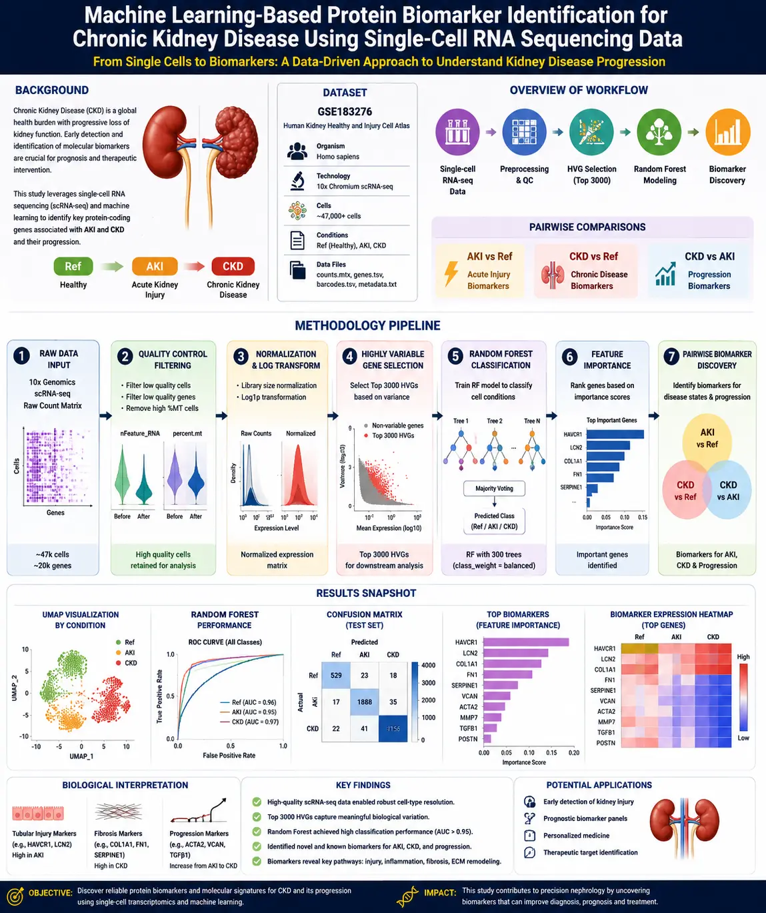
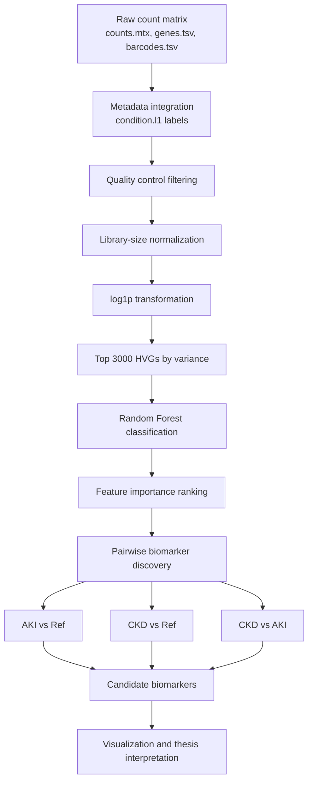

# Machine Learning-Based Protein Biomarker Identification for Chronic Kidney Disease Using Single-Cell RNA Sequencing Data

[](https://www.python.org/)
[](https://www.ncbi.nlm.nih.gov/geo/query/acc.cgi?acc=GSE183276)
[](https://scikit-learn.org/stable/modules/generated/sklearn.ensemble.RandomForestClassifier.html)
[](thesis/main.tex)
[](#references)

## Overview

This repository contains a complete bioinformatics and machine learning workflow for identifying candidate protein-coding biomarkers of kidney injury and chronic kidney disease from the **GSE183276 Human Kidney Healthy and Injury Cell Atlas** single-cell RNA sequencing dataset.

The project focuses on three pairwise biomarker discovery tasks:

| Analysis | Biological question | Expected interpretation |
|---|---|---|
| `AKI vs Ref` | Which genes distinguish acute kidney injury from reference kidney tissue? | Acute tubular injury, stress response, inflammation |
| `CKD vs Ref` | Which genes distinguish chronic kidney disease from reference kidney tissue? | Fibrosis, extracellular matrix remodeling, persistent inflammation |
| `CKD vs AKI` | Which genes may indicate progression from acute injury toward chronic disease? | Repair failure, maladaptive fibrosis, chronic immune activation |

The final machine learning analysis uses the processed dataset:

```text
GSE183276_HVG3000_by_variance.h5ad
```

with the top 3000 highly variable genes selected by variance, single cells as samples, and `condition.l1` as the target label.

## Biological Background

Chronic kidney disease (CKD) is a progressive disorder characterized by irreversible loss of kidney function, nephron damage, interstitial fibrosis, vascular dysfunction, and sustained inflammatory remodeling. Acute kidney injury (AKI), in contrast, is a rapid decline in renal function that may be reversible, but incomplete repair after AKI can increase the risk of CKD progression.

Single-cell RNA sequencing (scRNA-seq) provides cell-resolution transcriptomic profiles, making it possible to identify disease-associated gene signatures within heterogeneous kidney tissue. Because many clinically relevant biomarkers are proteins encoded by disease-regulated genes, transcriptomic biomarkers can guide downstream protein biomarker prioritization.

Important kidney injury and fibrosis-associated genes considered in this project include:

| Gene | Biological relevance |
|---|---|
| `HAVCR1` | Encodes KIM-1, a proximal tubular injury marker often elevated after AKI |
| `LCN2` | Encodes NGAL, a widely studied injury and stress-response biomarker |
| `COL1A1` | Collagen gene linked with extracellular matrix deposition and fibrosis |
| `FN1` | Fibronectin, associated with matrix remodeling and fibrotic progression |
| `SERPINE1` | PAI-1, associated with fibrosis, inflammation, and impaired tissue repair |

## Dataset

| Field | Description |
|---|---|
| GEO accession | `GSE183276` |
| Dataset name | Human Kidney Healthy and Injury Cell Atlas |
| Organism | *Homo sapiens* |
| Technology | 10x Chromium single-cell RNA sequencing |
| Input matrix | `counts.mtx` |
| Feature file | `genes.tsv` |
| Barcode file | `barcodes.tsv` |
| Metadata | `metadata.txt` / GSE183276 metadata file |
| Target label | `condition.l1` |
| Classes | `Ref`, `AKI`, `CKD` |
| Final processed file | `GSE183276_HVG3000_by_variance.h5ad` |

## Pipeline



## Machine Learning Strategy

The primary classifier is `RandomForestClassifier`, trained on single-cell expression profiles from the selected HVG matrix.

| Parameter | Value |
|---|---|
| Estimator | `RandomForestClassifier` |
| Trees | `n_estimators=300` |
| Class balancing | `class_weight="balanced"` |
| Random seed | `random_state=42` |
| Features | Top 3000 HVGs selected by variance |
| Labels | `condition.l1` |

Random Forest is suitable for this task because it can model non-linear expression patterns, is relatively robust to noisy high-dimensional data, and provides feature importance scores that can be used for biomarker prioritization.

## Biomarker Scoring

Candidate genes are ranked using a combined score that integrates model importance with biological effect size:

```text
combined_score = RF importance x abs(expression difference)
```

This score prioritizes genes that are both predictive for classification and meaningfully different between disease states.

## Installation

Create and activate a Python environment:

```bash
python -m venv .venv
source .venv/bin/activate
pip install -r requirements.txt
```

Recommended optional packages for thesis figure generation:

```bash
pip install seaborn scanpy anndata matplotlib scikit-learn pandas numpy scipy
```

## Usage

The repository contains notebook-based analysis steps and a legacy full pipeline:

| File | Purpose |
|---|---|
| `01.Dataset_Overview.ipynb` | Dataset inspection |
| `02.Dataset_Visualize.ipynb` | Initial visualization |
| `03.qc_filtering.ipynb` | QC filtering |
| `04.Normalization.ipynb` | Normalization and log transformation |
| `05.HVG_selection.ipynb` | HVG selection |
| `06.Random Forest using HVGs.ipynb` | Multi-class Random Forest |
| `07.Class-Specfic Biomarker.ipynb` | Pairwise biomarker discovery |
| `full_old_analysis/biomarker_pipeline.py` | Earlier end-to-end pipeline |
| `thesis/scripts/generate_thesis_figures.py` | Publication-style thesis figure generator |

Generate thesis figures:

```bash
python thesis/scripts/generate_thesis_figures.py
```

Compile the thesis:

```bash
cd thesis
latexmk -pdf main.tex
```

or:

```bash
cd thesis
pdflatex main.tex
bibtex main
pdflatex main.tex
pdflatex main.tex
```

## Outputs

Key outputs are stored in `results/`:

| Output | Description |
|---|---|
| `RF_classification_report.csv` | Multi-class classification metrics |
| `RF_confusion_matrix.csv` | Multi-class confusion matrix |
| `RF_HVG3000_feature_importance.csv` | Random Forest feature importance |
| `RF_top100_biomarker_genes.csv` | Top ranked genes |
| `AKI_vs_Ref_RF_biomarkers.csv` | AKI biomarker candidates |
| `CKD_vs_Ref_RF_biomarkers.csv` | CKD biomarker candidates |
| `CKD_vs_AKI_RF_biomarkers.csv` | CKD progression biomarker candidates |
| `*_ROC.png` | ROC curve visualizations |
| `*_RF_top20.png` | Top feature importance plots |
| `*_RF_confusion_matrix.csv` | Pairwise confusion matrices |

## Visualization

The analysis generates QC histograms, class distribution plots, HVG variance plots, Random Forest feature-importance plots, confusion matrices, ROC curves, and pairwise biomarker figures. Thesis-ready figure placeholders and optional regenerated figures are stored in `thesis/figures/`.

## Results Summary

The pipeline identifies candidate biomarkers associated with kidney injury and disease progression. Injury-associated genes such as `HAVCR1` and `LCN2` are biologically consistent with tubular stress and acute damage, while matrix-remodeling genes such as `COL1A1`, `FN1`, and `SERPINE1` support chronic fibrosis and maladaptive repair mechanisms. The `CKD vs AKI` analysis is especially important because it targets genes that may distinguish transient acute injury from chronic pathological remodeling.

## Thesis Project

The LaTeX thesis scaffold is available in `thesis/`. It includes IEEE-style references, modular chapters, mathematical formulations, TikZ workflow diagrams, figure placeholders, tables, appendices, and compilation instructions.

## Future Work

- Validate candidate biomarkers using independent CKD and AKI cohorts.
- Integrate differential expression testing with cell-type-specific analysis.
- Map transcriptomic candidates to secreted or membrane protein databases.
- Compare Random Forest with XGBoost, elastic net, support vector machines, and neural models.
- Perform pathway enrichment for fibrosis, inflammation, tubular injury, and extracellular matrix remodeling.
- Validate top candidates experimentally using ELISA, immunohistochemistry, or proteomics.

## References

The full BibTeX bibliography is provided in [`thesis/bibliography/references.bib`](thesis/bibliography/references.bib). Key topics include single-cell transcriptomics, kidney injury atlases, CKD fibrosis biomarkers, AKI biomarkers, and machine learning-based biomarker discovery.
